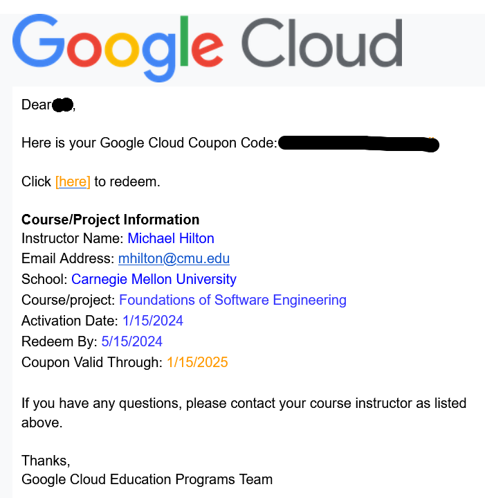
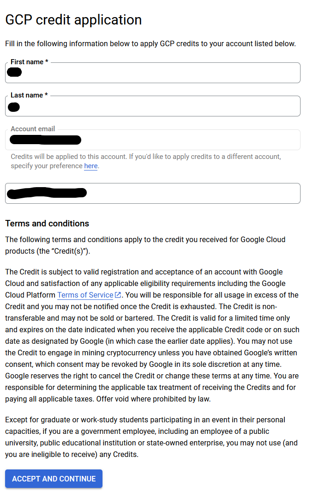
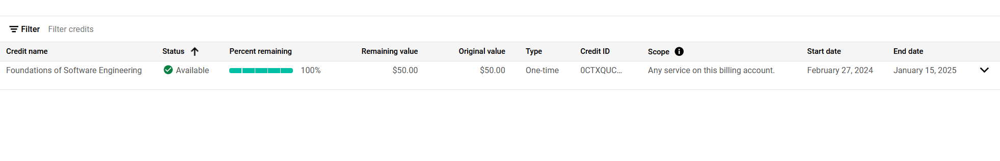
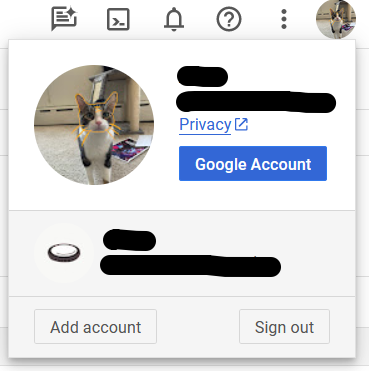
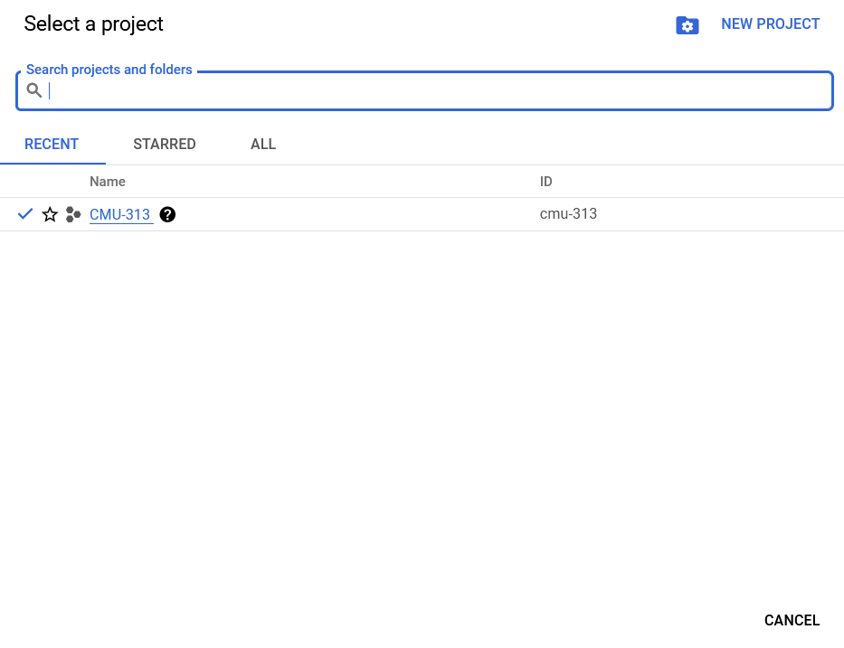
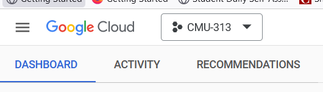

## Redeem GCP Credits

1. In your email, click the `Student Coupon Retrieval Link`.

2. Enter your name and **Andrew** email address.

3. Go to your andrew email accout and verify your email address

4. You will recieve another email with GCP coupon right after your email is verified. Click the link to redeem the coupon code.

5. In the webpage, pay attention to the **Account email**, which could be different from your andrew email if you have multiple Google account.

6. You will be redirect to your GCP console Billing page after you click `Accept and Continue`. You can confirm your have received the credits by goto `Credits`. You see the credits below:

If you do not see the credit, please make sure:

- You are using right Google account:

- You can also see your billing accounts [here](https://console.cloud.google.com/billing). The GCP credits are inside `Billing Account for Education`.

## Create a new project

You need to create a project to use your GCP credits.

- Goto [GCP console](https://console.cloud.google.com), select `CREATE or SELECT A PROJECT`, `NEW PROJECT`
- In project name, put `CMU-313` or any project name you like and click `CREATE`. You can leave Location to no organization.
- It takes 1~2 mins to create the project. After your project is created you can select the project.

> [!WARNING]
> If you only have one billing account (Billing Account for Education), GCP will associate the project wit this billing account automatically. However, if you have multiple billing accounts. Please make sure you select `Billing Account for Education` for this project. Otherwise, GCP may charge you.

## Create a new VM

Once you have your project ready. Go back to the [dashboard](https://console.cloud.google.com/home/dashboard) and make sure you select project `CMU-313`

- In the search bar, type `vm` and select `Add VM Instance`. If GCP asks you to enable compute engine Api, click `ENABLE`. Then you need to go back to the dashboard and click `Add VM Instance` again.

- In the instance creation page:
    - Name: `nodebb-instance` or any name you like
    - Machine type: `e2-medium`
    - Boot disk:
        - Click `Change`
        - Operation system: `Ubuntu`
        - Version: `Ubuntu 22.04 LTS`
    - Leave the rest config default.

- While the instance is creating, you may need to configure the firewall rule to enable NodeBB access.
    - In the search bar, type and click `firewall`
    - Click `Create firewall rule`
        - Name: `nodebb-access`
        - Targets: `All instances in the network`
        - Source IPv4 ranges: `0.0.0.0/0`
        - Protocols and ports:
            - check `TCP`
            - Ports: `4567`
    - Click `save`

- Now your VM should be ready, you can access the VM from your dashboard or search and click `Compute Engine`.
